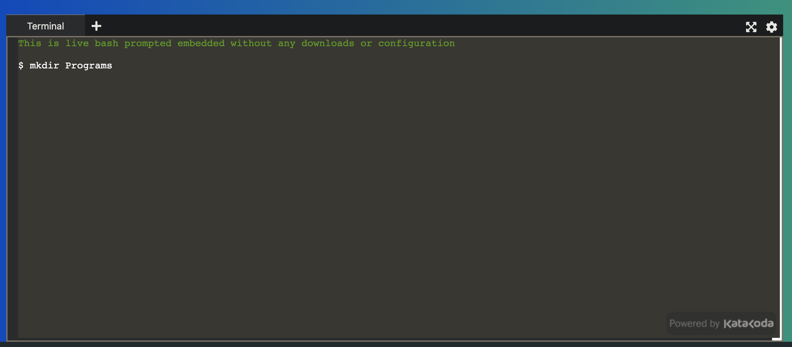
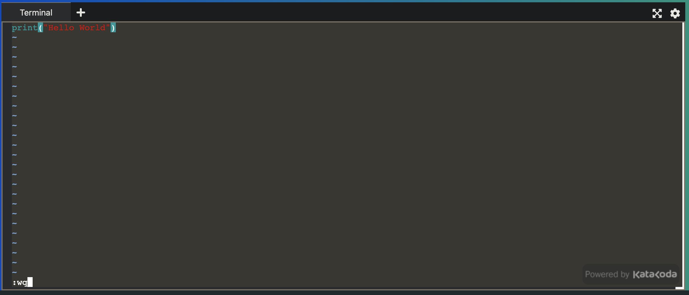

# How to make a simple python program

1: Navigate to https://www.katacoda.com/embed/terminal. This is a site that emulates a terminal environment.

The website should look like this. You will be working in the terminal. There is no need to log in.

2: Make a folder by typing the command `mkdir` followed by the name of the folder, i.e. `mkdir Programs` <kbd>Enter</kbd>  
  (`mkdir` stands for 'Make Directory').

3: Navigate into the folder by typing `cd` then the name of your folder. i.e. `cd Programs` <kbd>Enter</kbd>  
  (`cd` stands for 'Change Directory') Keep in mind, commands and folder/file names are case sensitive.

4: Create the program using the `touch` command followed by the name of your file i.e. `touch app.py` <kbd>Enter</kbd>  
***Be sure to include the `.py` file extension.*** This is declaring which programming language you will use (in this case, the language is Python).

5: Enter the file using the command `vim` followed by the name of the file. i.e. `vim app.py` <kbd>Enter</kbd>.

6: You are now inside Vim, a modal text editing program. By default, you are in command mode. Press the <kbd>i</kbd> key to enter insert mode and the bottom of the window should say `-- INSERT --` to indicate that you have successfully entered insert mode.

7: Type the syntax `print(“`whatever you want to print`”)`. i.e. `print(“Hello World!”)`.

8: Press the <kbd>ESC</kbd> key to switch back to command mode.

9: Save and quit by typing `:wq` <kbd>Enter</kbd> The `:` followed by a command will execute a command in Vim. `w` for 'write' and `q` for 'quit'.

10: To run your program, type into the terminal `python3` followed by the name of your file, i.e. `python3 app.py` <kbd>Enter</kbd>.

11: The text you inserted between the “” should appear on the following line.

