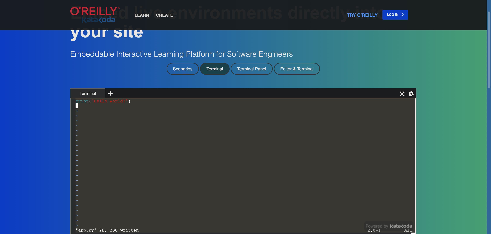

# How to make a simple python program

1: Navigate to https://www.katacoda.com/embed/terminal. This is a site that emulates a terminal environment.

The website should look like this

2: Make a folder by typing the command `mkdir` followed by the name of the folder, followed by the <kbd>Enter</kbd> key i.e. `mkdir Programs` <kbd>Enter</kbd>

3: Navigate into the folder by typing `cd` then the name of your folder. i.e. `cd Programs` <kbd>Enter</kbd>

4: Create the program using the `touch` command. i.e. `touch app.py` <kbd>Enter</kbd>. Be sure to include the `.py` file extension. This is declaring which programming language you will use (in this case, the language is Python).

5: Enter the file using the command `vim` followed by the name of the file. i.e. `vim app.py`

6: You are now inside Vim, a modal text editing program. By default, you are in command mode. Press the <kbd>I</kbd> key to enter insert mode.

7: Here you should see your cursor flashing at the top of the screen. Type the syntax `print(“`whatever you want to print`”)`. i.e. `print(“Hello World!”)`

8: Press the <kbd>ESC</kbd> key to switch back to command mode.

9: Save and quit by typing `:wq` <kbd>Enter</kbd>

10: To run your program, type into the terminal `python3` followed by the name of your app. i.e. `python3 app.py` <kbd>Enter</kbd>

11: The text you inserted between the “” should appear.
