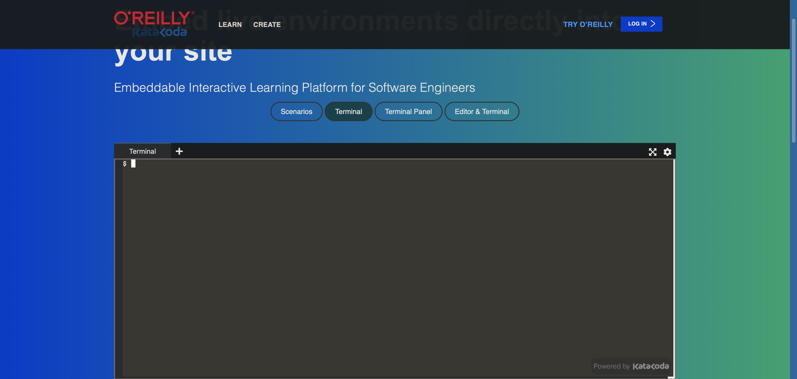

1: Enter your browser of choice

2: navigate to https://www.katacoda.com/embed/terminal

 

Ensure the website looks like this

3: Make a folder using the command `mkdir` which stands for make directory. Name the folder whatever you want but avoid spaces. i.e. `mkdir Programs`

4: Navigate into the folder using ` cd ` then the name of your folder. i.e. `cd Programs`

5: create the program using the `touch` command. i.e. `touch app.py`. Ensure you include the `.py`. Without this, it will fail.

6: enter the file using the command `vim` followed by the name of the file. i.e. `vim app.py`

7: You are now inside vim. Vim is a model text editing program. By default, you are in command mode. Press <kbd>i</kbd> to enter insert mode.

8: Here you should see your cursor flashing at the top of the screen. To make your program print a word or phrase to the terminal, insert the syntax `print(“`whatever you want to print`”)`. i.e. `print(“ Hello World!”)`

9: press the <kbd>esc</kbd> to enter command mode

10: Save and quite using `:wq`

11: To run your program, type into the terminal `python3` followed by the name of your app. i.e. `python3 app.py`

12: The text you inserted between the “” should appear. 

